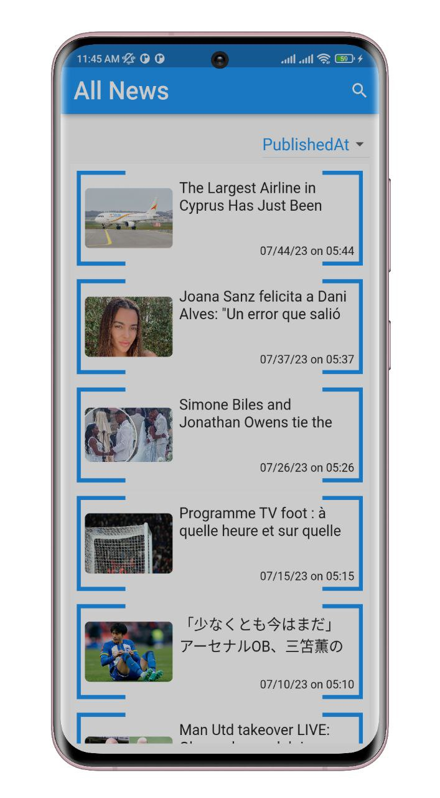
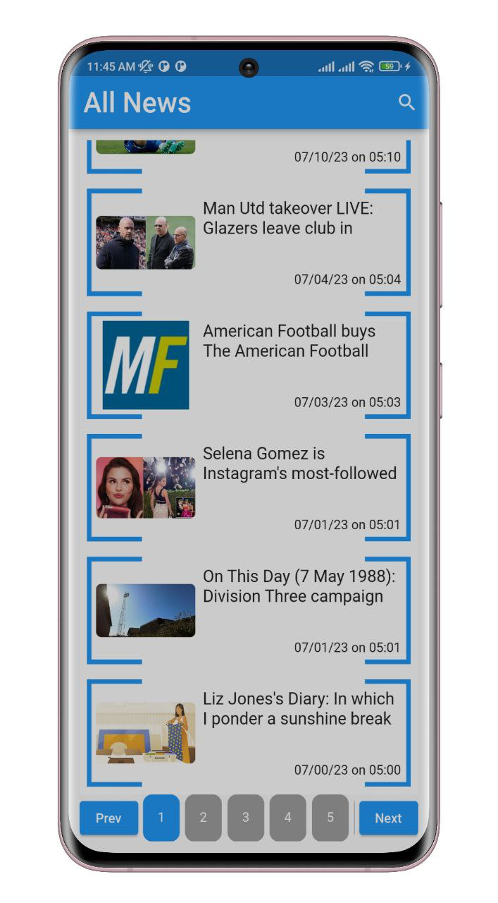
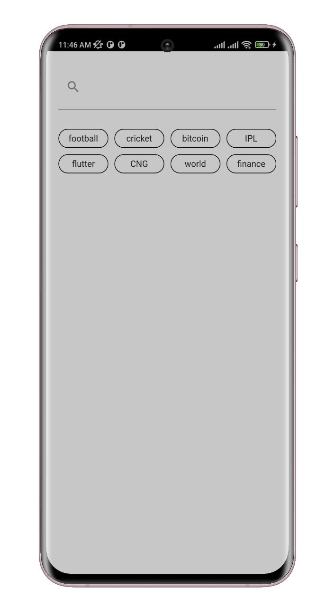
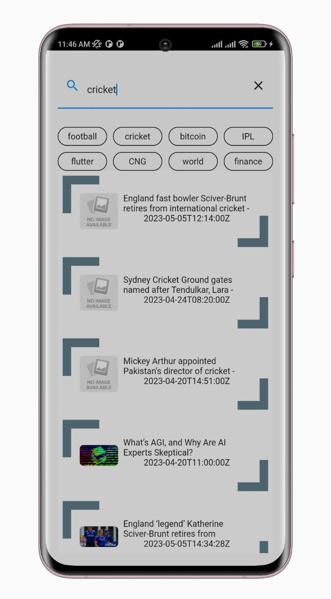

# News Application

Popular latest news articles can read through this application. There are seven category news that can simply access anyone. Not only that, whenever user click on a specified articles, it goes to the specified news website. Webview is also used.


## Screenshots

<p align="center">
  
  
  
  
  
</p>


## Features

- Easy to use
- Live previews
- Fullscreen mode
- Cross platform


## Setup

Clone the repository

```bash
  git clone https://github.com/Tofazzal-2443/News-App.git
```
Move to the desired folder

```bash
  cd \News_app
```
To run the app, simply write

```bash
  flutter pub get
```
```bash
  flutter run
```
## Tech Stack

**Built With:** Dart, Flutter
**State Management:** Provider
**Data:** Rest API


## Platform

- Android


## Support

For support, please contact here [](https://www.linkedin.com/in/tofazzal15/)
